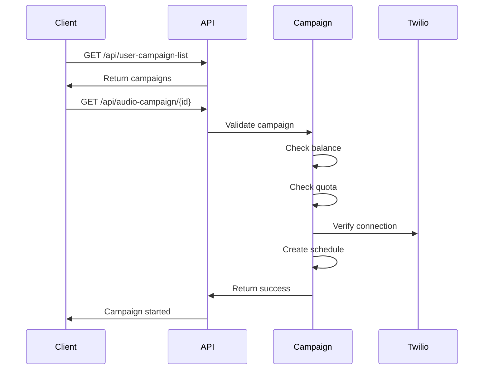

## Introduction

The Campaign API allows you to manage voice campaigns programmatically. You can list campaigns and start campaign execution through WordPress-integrated endpoints.

## Authentication

Campaign endpoints use **WordPress Integration Token** authentication via the `wordpress` middleware.

<Info>
  All campaign endpoints require a valid `user_token` parameter. See [Authentication](/api/authentication) for details.
</Info>

## Base URL

```
https://your-domain.com/api
```

## Available Endpoints

<CardGroup cols={2}>
  <Card title="List Campaigns" icon="list" href="/api/campaigns/list">
    Get all campaigns for authenticated user
  </Card>
  <Card title="Start Campaign" icon="play" href="/api/campaigns/start">
    Execute a campaign by ID
  </Card>
</CardGroup>

## Common Use Cases

### 1. WordPress Integration

Integrate TelemanAI campaigns directly into your WordPress site:

- Trigger campaigns from WordPress admin panel
- Display campaign lists in custom WordPress pages
- Automate campaign execution based on WordPress events

### 2. External Application Integration

Connect third-party applications to TelemanAI:

- CRM systems triggering voice campaigns
- Marketing automation platforms
- Custom dashboards and reporting tools

### 3. Automated Campaign Management

Automate campaign workflows:

- Schedule campaigns via cron jobs
- Trigger campaigns based on business logic
- Integrate with webhooks and event systems

## Campaign Workflow



## Campaign Validation

When starting a campaign, the API performs several validation checks:

<Steps>
  <Step title="Balance Check">
    Verifies the user has sufficient balance to execute the campaign
  </Step>
  <Step title="Configuration Check">
    Ensures campaign has both group_id and provider configured
  </Step>
  <Step title="Quota Check">
    Validates hourly quota hasn't been exceeded for the provider
  </Step>
  <Step title="Connection Check">
    Verifies Twilio connection is active and valid
  </Step>
</Steps>

## Error Handling

The Campaign API returns specific error messages for different failure scenarios:

| Error Message | Status Code | Description |
|--------------|-------------|-------------|
| `Unauthorized` | 401 | Invalid or missing user_token |
| `Insufficient balance` | 401 | User account has insufficient funds |
| `Campaign has no group or provider` | 401 | Campaign missing required configuration |
| `Hourly quota crossed` | 400 | Provider hourly limit reached |
| `Connection Failed` | 401 | Twilio connection issue |

## Rate Limits

<Warning>
  Campaign endpoints are subject to hourly quota limits configured per provider. Exceeding these limits will result in a `400` error.
</Warning>

## Next Steps

<CardGroup cols={2}>
  <Card title="List Campaigns" icon="list" href="/api/campaigns/list">
    Learn how to retrieve campaign lists
  </Card>
  <Card title="Start Campaign" icon="play" href="/api/campaigns/start">
    Learn how to execute campaigns
  </Card>
</CardGroup>