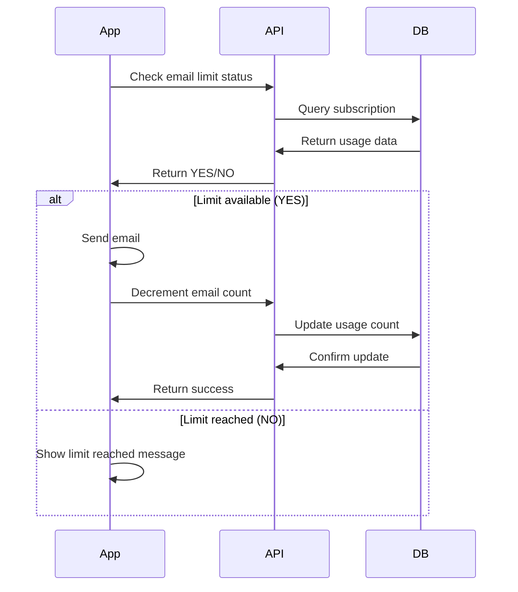

## Overview

The Usage Limits API allows you to check and manage email and SMS usage for customer subscriptions. All endpoints require **SaaS Key** authentication.

## Authentication

All usage limit endpoints use the `check.expiry` middleware which requires a valid `saas_key` parameter.

<Info>
  See [Authentication](/api/authentication) for details on SaaS Key authentication.
</Info>

## Common Parameters

All endpoints accept the following parameters:

<ParamField body="saas_key" type="string" required>
  SaaS authentication key matching the environment variable `SAAS_KEY`
</ParamField>

<ParamField body="domain" type="string" required>
  Customer domain to check usage limits for. The domain is automatically normalized using `trimDomain()`
</ParamField>

---

## Email Limits

### Get Total Email Limit

Retrieve the total email limit for a subscription.

```
GET /api/user-emails-limit
```

<CodeGroup>
```bash curl
curl -X GET "https://your-domain.com/api/user-emails-limit?saas_key=YOUR_SAAS_KEY&domain=customer-domain.com" \
  -H "Accept: application/json"
```

```javascript JavaScript
const response = await fetch(
  'https://your-domain.com/api/user-emails-limit?' + new URLSearchParams({
    saas_key: 'YOUR_SAAS_KEY',
    domain: 'customer-domain.com'
  }),
  { headers: { 'Accept': 'application/json' } }
);

const emailLimit = await response.json();
console.log('Total email limit:', emailLimit);
```
</CodeGroup>

**Response:**
```json
1000
```

Returns the total number of emails included in the subscription package.

---

### Check Email Limit Status

Verify if the email limit has been reached.

```
GET /api/user-email-limit-check
```

<CodeGroup>
```bash curl
curl -X GET "https://your-domain.com/api/user-email-limit-check?saas_key=YOUR_SAAS_KEY&domain=customer-domain.com" \
  -H "Accept: application/json"
```

```javascript JavaScript
const response = await fetch(
  'https://your-domain.com/api/user-email-limit-check?' + new URLSearchParams({
    saas_key: 'YOUR_SAAS_KEY',
    domain: 'customer-domain.com'
  })
);

const canSendEmail = await response.text();
if (canSendEmail === 'YES') {
  console.log('✓ Can send emails');
} else {
  console.log('✗ Email limit reached');
}
```
</CodeGroup>

**Response:**
```text
YES  // Can send emails
NO   // Limit reached
```

---

### Get Remaining Email Limit

Get the number of emails remaining in the subscription.

```
GET /api/user-email-limit-left
```

<CodeGroup>
```bash curl
curl -X GET "https://your-domain.com/api/user-email-limit-left?saas_key=YOUR_SAAS_KEY&domain=customer-domain.com" \
  -H "Accept: application/json"
```

```php PHP
<?php
$client = new GuzzleHttp\Client();

$response = $client->request('GET', 'https://your-domain.com/api/user-email-limit-left', [
    'query' => [
        'saas_key' => 'YOUR_SAAS_KEY',
        'domain' => 'customer-domain.com'
    ]
]);

$emailsLeft = (int) $response->getBody();
echo "Emails remaining: {$emailsLeft}";
```
</CodeGroup>

**Response:**
```json
450
```

Returns the number of emails remaining in the current subscription period.

---

### Decrement Email Limit

Decrement the email count when an email is sent.

```
POST /api/user-email-limit-decrement
```

<CodeGroup>
```bash curl
curl -X POST "https://your-domain.com/api/user-email-limit-decrement" \
  -H "Content-Type: application/json" \
  -H "Accept: application/json" \
  -d '{
    "saas_key": "YOUR_SAAS_KEY",
    "domain": "customer-domain.com"
  }'
```

```javascript JavaScript
const response = await fetch(
  'https://your-domain.com/api/user-email-limit-decrement',
  {
    method: 'POST',
    headers: {
      'Content-Type': 'application/json',
      'Accept': 'application/json'
    },
    body: JSON.stringify({
      saas_key: 'YOUR_SAAS_KEY',
      domain: 'customer-domain.com'
    })
  }
);

const result = await response.json();
console.log('Email count decremented:', result);
```

```python Python
import requests

response = requests.post(
    'https://your-domain.com/api/user-email-limit-decrement',
    json={
        'saas_key': 'YOUR_SAAS_KEY',
        'domain': 'customer-domain.com'
    }
)

print('Email limit decremented')
```
</CodeGroup>

**Response:**
```json
true
```

Returns `true` if the decrement was successful.

---

## SMS Limits

### Get Total SMS Limit

Retrieve the total SMS limit for a subscription.

```
GET /api/user-sms-limit
```

<CodeGroup>
```bash curl
curl -X GET "https://your-domain.com/api/user-sms-limit?saas_key=YOUR_SAAS_KEY&domain=customer-domain.com" \
  -H "Accept: application/json"
```

```javascript JavaScript
const response = await fetch(
  'https://your-domain.com/api/user-sms-limit?' + new URLSearchParams({
    saas_key: 'YOUR_SAAS_KEY',
    domain: 'customer-domain.com'
  })
);

const smsLimit = await response.json();
console.log('Total SMS limit:', smsLimit);
```
</CodeGroup>

**Response:**
```json
500
```

Returns the total number of SMS messages included in the subscription package.

---

### Check SMS Limit Status

Verify if the SMS limit has been reached.

```
GET /api/user-sms-limit-check
```

<CodeGroup>
```bash curl
curl -X GET "https://your-domain.com/api/user-sms-limit-check?saas_key=YOUR_SAAS_KEY&domain=customer-domain.com" \
  -H "Accept: application/json"
```

```javascript JavaScript
const response = await fetch(
  'https://your-domain.com/api/user-sms-limit-check?' + new URLSearchParams({
    saas_key: 'YOUR_SAAS_KEY',
    domain: 'customer-domain.com'
  })
);

const canSendSMS = await response.text();
if (canSendSMS === 'YES') {
  console.log('✓ Can send SMS');
} else {
  console.log('✗ SMS limit reached');
}
```
</CodeGroup>

**Response:**
```text
YES  // Can send SMS
NO   // Limit reached
```

---

### Get Remaining SMS Limit

Get the number of SMS messages remaining in the subscription.

```
GET /api/user-sms-limit-left
```

<CodeGroup>
```bash curl
curl -X GET "https://your-domain.com/api/user-sms-limit-left?saas_key=YOUR_SAAS_KEY&domain=customer-domain.com" \
  -H "Accept: application/json"
```

```php PHP
<?php
$response = wp_remote_get(
    'https://your-domain.com/api/user-sms-limit-left?' . http_build_query([
        'saas_key' => 'YOUR_SAAS_KEY',
        'domain' => 'customer-domain.com'
    ])
);

$smsLeft = (int) wp_remote_retrieve_body($response);
echo "SMS remaining: {$smsLeft}";
```
</CodeGroup>

**Response:**
```json
250
```

Returns the number of SMS messages remaining in the current subscription period.

---

### Decrement SMS Limit

Decrement the SMS count when a message is sent.

```
POST /api/user-sms-limit-decrement
```

<CodeGroup>
```bash curl
curl -X POST "https://your-domain.com/api/user-sms-limit-decrement" \
  -H "Content-Type: application/json" \
  -H "Accept: application/json" \
  -d '{
    "saas_key": "YOUR_SAAS_KEY",
    "domain": "customer-domain.com"
  }'
```

```javascript JavaScript
const response = await fetch(
  'https://your-domain.com/api/user-sms-limit-decrement',
  {
    method: 'POST',
    headers: {
      'Content-Type': 'application/json',
      'Accept': 'application/json'
    },
    body: JSON.stringify({
      saas_key: 'YOUR_SAAS_KEY',
      domain: 'customer-domain.com'
    })
  }
);

const result = await response.json();
console.log('SMS count decremented:', result);
```

```python Python
import requests

response = requests.post(
    'https://your-domain.com/api/user-sms-limit-decrement',
    json={
        'saas_key': 'YOUR_SAAS_KEY',
        'domain': 'customer-domain.com'
    }
)

print('SMS limit decremented')
```
</CodeGroup>

**Response:**
```json
true
```

Returns `true` if the decrement was successful.

---

## Error Responses

All endpoints return the same error format:

```json
{
  "error": "Unauthorized"
}
```

| Status Code | Description |
|------------|-------------|
| 200 | Success |
| 401 | Unauthorized - Invalid or missing saas_key |

---

## Usage Workflow



---

## Example Use Cases

### Check Before Sending Email

```php
<?php
function can_send_email($domain) {
    $response = wp_remote_get(
        'https://your-domain.com/api/user-email-limit-check?' . http_build_query([
            'saas_key' => env('SAAS_KEY'),
            'domain' => $domain
        ])
    );
    
    return wp_remote_retrieve_body($response) === 'YES';
}

function send_customer_email($domain, $recipient, $message) {
    if (!can_send_email($domain)) {
        return ['error' => 'Email limit reached'];
    }
    
    // Send email
    $sent = wp_mail($recipient, 'Subject', $message);
    
    if ($sent) {
        // Decrement the limit
        wp_remote_post('https://your-domain.com/api/user-email-limit-decrement', [
            'body' => json_encode([
                'saas_key' => env('SAAS_KEY'),
                'domain' => $domain
            ]),
            'headers' => ['Content-Type' => 'application/json']
        ]);
        
        return ['success' => 'Email sent'];
    }
    
    return ['error' => 'Failed to send email'];
}
```

### Display Usage Statistics

```javascript
async function getUsageStats(domain, saasKey) {
  const params = new URLSearchParams({ saas_key: saasKey, domain });
  const baseUrl = 'https://your-domain.com/api';
  
  // Fetch all stats in parallel
  const [emailLimit, emailLeft, smsLimit, smsLeft] = await Promise.all([
    fetch(`${baseUrl}/user-emails-limit?${params}`).then(r => r.json()),
    fetch(`${baseUrl}/user-email-limit-left?${params}`).then(r => r.json()),
    fetch(`${baseUrl}/user-sms-limit?${params}`).then(r => r.json()),
    fetch(`${baseUrl}/user-sms-limit-left?${params}`).then(r => r.json())
  ]);
  
  return {
    email: {
      total: emailLimit,
      remaining: emailLeft,
      used: emailLimit - emailLeft,
      percentage: ((emailLimit - emailLeft) / emailLimit * 100).toFixed(1)
    },
    sms: {
      total: smsLimit,
      remaining: smsLeft,
      used: smsLimit - smsLeft,
      percentage: ((smsLimit - smsLeft) / smsLimit * 100).toFixed(1)
    }
  };
}

// Usage
const stats = await getUsageStats('customer-domain.com', 'YOUR_SAAS_KEY');
console.log(`Email usage: ${stats.email.used}/${stats.email.total} (${stats.email.percentage}%)`);
console.log(`SMS usage: ${stats.sms.used}/${stats.sms.total} (${stats.sms.percentage}%)`);
```

### Rate Limiting Middleware

```python
from functools import wraps
import requests

def check_email_limit(func):
    """Decorator to check email limit before executing function"""
    @wraps(func)
    def wrapper(domain, *args, **kwargs):
        response = requests.get(
            'https://your-domain.com/api/user-email-limit-check',
            params={
                'saas_key': 'YOUR_SAAS_KEY',
                'domain': domain
            }
        )
        
        if response.text == 'YES':
            result = func(domain, *args, **kwargs)
            
            # Decrement after successful send
            requests.post(
                'https://your-domain.com/api/user-email-limit-decrement',
                json={'saas_key': 'YOUR_SAAS_KEY', 'domain': domain}
            )
            
            return result
        else:
            raise Exception('Email limit reached')
    
    return wrapper

@check_email_limit
def send_notification_email(domain, recipient, message):
    # Your email sending logic
    print(f"Sending email to {recipient}")
    return True

# Usage
try:
    send_notification_email('customer-domain.com', 'user@example.com', 'Hello!')
    print("Email sent successfully")
except Exception as e:
    print(f"Error: {e}")
```

---

## Notes

<Warning>
  Always check the limit status before sending emails or SMS. Decrement the count only after successful delivery.
</Warning>

<Info>
  - Domains are automatically normalized using `trimDomain()`
  - Usage counts are tracked in the `item_limit_count` table
  - Limits reset based on the subscription period
  - Helper functions abstract the implementation details
</Info>

## Related Endpoints

<CardGroup cols={2}>
  <Card title="Check Expiry" icon="clock" href="/api/subscriptions/check-expiry">
    Verify subscription status
  </Card>
  <Card title="Authentication" icon="key" href="/api/authentication">
    Learn about SaaS Key authentication
  </Card>
</CardGroup>