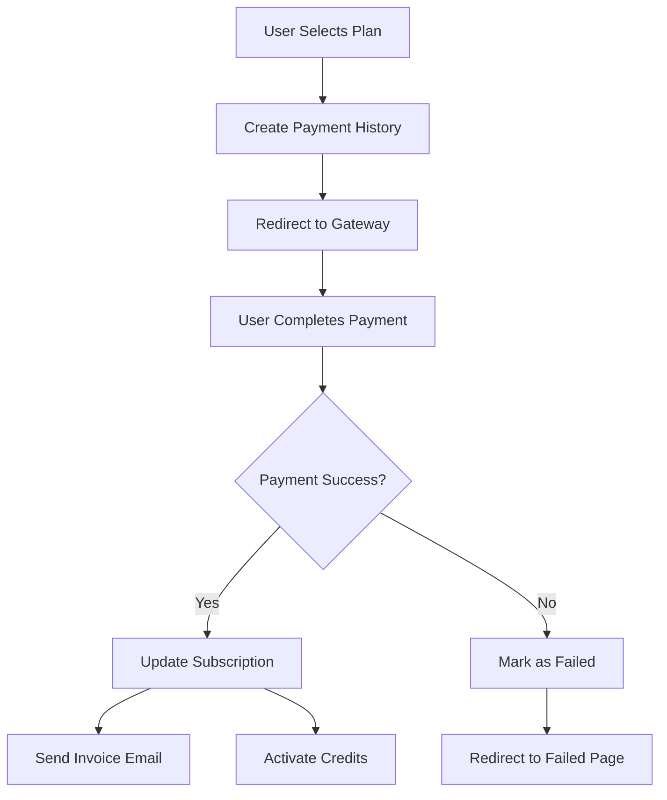

## Supported Payment Gateways

TelemanAI supports multiple payment gateways for subscription billing and pay-as-you-go services. Choose the gateway that best fits your region and business needs.

## Available Payment Gateways

<CardGroup cols={3}>
  <Card title="Stripe" icon="stripe" href="/integrations/stripe">
    International credit card processing
  </Card>
  <Card title="PayPal" icon="paypal" href="/integrations/paypal">
    Global payment platform
  </Card>
  <Card title="Razorpay" icon="credit-card" href="/integrations/razorpay">
    India's leading payment gateway
  </Card>
  <Card title="Flutterwave" icon="credit-card">
    African payment solutions
  </Card>
  <Card title="Paystack" icon="credit-card">
    African payment infrastructure
  </Card>
  <Card title="Instamojo" icon="credit-card">
    Indian payment solution
  </Card>
  <Card title="Braintree" icon="credit-card">
    PayPal-owned gateway
  </Card>
  <Card title="Mollie" icon="credit-card">
    European payment methods
  </Card>
  <Card title="Square" icon="square">
    All-in-one payment solution
  </Card>
  <Card title="SSLCommerz" icon="credit-card">
    Bangladesh payment gateway
  </Card>
  <Card title="Squad" icon="credit-card">
    Nigerian payment processing
  </Card>
</CardGroup>

## Gateway Comparison

| Gateway | Best For | Currencies | Test Mode | Integration |
|---------|----------|------------|-----------|-------------|
| **Stripe** | Global | 135+ currencies | Yes | API-based |
| **PayPal** | Global | 25+ currencies | Sandbox | OAuth/API |
| **Razorpay** | India | INR | Yes | API-based |
| **Flutterwave** | Africa | Multiple | Yes | API-based |
| **Paystack** | Africa | NGN, ZAR, GHS | Yes | API-based |
| **Instamojo** | India | INR | Yes | API-based |
| **Braintree** | Global | Multiple | Yes | SDK |
| **Mollie** | Europe | EUR, GBP, USD | Yes | API-based |
| **Square** | US, UK, Canada | Multiple | Sandbox | OAuth/API |
| **SSLCommerz** | Bangladesh | BDT | Sandbox | API-based |
| **Squad** | Nigeria | NGN, USD | Sandbox | API-based |

## Configuration Overview

All payment gateways are configured through environment variables in the `.env` file.

### Environment Variables by Gateway

#### Stripe
```bash
STRIPE="YES"
STRIPE_ENVIRONMENT="sandbox"
STRIPE_KEY="pk_test_..."
STRIPE_SECRET="sk_test_..."
```

#### PayPal
```bash
PAYPAL="YES"
PAYPAL_SANDBOX=true
PAYPAL_CLIENT_ID="..."
PAYPAL_CLIENT_SECRET="..."
PAYPAL_CURRENCY="USD"
```

#### Razorpay
```bash
RAZORPAY="YES"
RAZORPAY_KEY="rzp_test_..."
RAZORPAY_SECRET="..."
```

#### Flutterwave
```bash
FLUTTERWAVE="YES"
FLW_PUBLIC_KEY="FLWPUBK_TEST-..."
FLW_SECRET_KEY="FLWSECK_TEST-..."
FLW_SECRET_HASH="..."
FLW_CURRENCY="NGN"
```

#### Paystack
```bash
PAYSTACK="YES"
PAYSTACK_PUBLIC_KEY="pk_test_..."
PAYSTACK_SECRET_KEY="sk_test_..."
PAYSTACK_PAYMENT_URL="https://api.paystack.co"
MERCHANT_EMAIL="..."
MERCHANT_CURRENCY="ZAR"
```

#### Instamojo
```bash
INSTAMOJO="YES"
IM_API_KEY="test_..."
IM_AUTH_TOKEN="test_..."
IM_URL="https://test.instamojo.com/api/1.1/"
```

#### Braintree
```bash
BRAINTREE="YES"
BT_ENVIRONMENT="sandbox"
BT_MERCHANT_ID="..."
BT_PUBLIC_KEY="..."
BT_PRIVATE_KEY="..."
```

#### Mollie
```bash
MOLLIE="YES"
MOLLIE_KEY="test_..."
MOLLIE_CURRENCY="EUR"
```

#### Square
```bash
SQUARE="YES"
SQUARE_ACCESS_TOKEN="..."
SQUARE_APPLICATION_ID="sandbox-..."
SQUARE_LOCATION_ID="..."
SQUARE_CURRENCY="USD"
SQUARE_REDIRECT_URL="${APP_URL}/square/callback"
```

#### SSLCommerz
```bash
SSL_COMMERZ="YES"
API_DOMAIN_URL="https://sandbox.sslcommerz.com"
STORE_ID="..."
STORE_PASSWORD="..."
```

#### Squad
```bash
SQUAD="YES"
SQUAD_PUBLIC_KEY="sandbox_pk_..."
SQUAD_SECRET_KEY="sandbox_sk_..."
SQUAD_CURRENCY="NGN"
SQUAD_API_URL="https://sandbox-api-d.squadco.com"
```

## Choosing a Payment Gateway

<Steps>
  <Step title="Consider Your Region">
    Choose a gateway with strong presence in your target market:

    - **North America/Europe**: Stripe, PayPal, Braintree
    - **Africa**: Flutterwave, Paystack, Squad
    - **India**: Razorpay, Instamojo
    - **Bangladesh**: SSLCommerz
    - **Europe**: Mollie, Stripe
  </Step>

  <Step title="Check Currency Support">
    Ensure the gateway supports your required currencies:

    - Multi-currency: Stripe, PayPal, Braintree
    - Local currency focused: Razorpay (INR), Paystack (NGN, ZAR)
  </Step>

  <Step title="Evaluate Fees">
    Compare transaction fees and setup costs:

    - Stripe: ~2.9% + $0.30 per transaction
    - PayPal: ~2.9% + $0.30 per transaction
    - Razorpay: ~2% per transaction (India)
    - Flutterwave: ~3.8% per transaction (Africa)
  </Step>

  <Step title="Test Integration">
    Most gateways provide sandbox/test modes:

    - Always test in sandbox mode first
    - Verify webhook delivery
    - Test failed payment scenarios
    - Confirm refund functionality
  </Step>
</Steps>

## Enabling a Gateway

<Steps>
  <Step title="Update Environment Variables">
    Add the gateway credentials to your `.env` file:

    ```bash
    STRIPE="YES"
    STRIPE_KEY="your_key_here"
    STRIPE_SECRET="your_secret_here"
    ```
  </Step>

  <Step title="Configure in Dashboard">
    1. Log in to TelemanAI admin panel
    2. Navigate to **Settings** → **Payment Gateways**
    3. Select the gateway you want to enable
    4. Enter your credentials
    5. Choose test or production mode
    6. Click **Save Configuration**
  </Step>

  <Step title="Test the Integration">
    1. Go to **Pricing** page
    2. Select a subscription plan
    3. Proceed to checkout
    4. Complete a test payment
    5. Verify the subscription is activated
  </Step>
</Steps>

## Payment Flow

TelemanAI follows a standard payment flow:



## Webhook Configuration

Most gateways require webhook endpoints for payment notifications:

| Gateway | Webhook URL | Events |
|---------|-------------|--------|
| Stripe | `/api/stripe/webhook` | `payment_intent.succeeded` |
| PayPal | `/api/paypal/webhook` | `PAYMENT.CAPTURE.COMPLETED` |
| Razorpay | `/api/razorpay/webhook` | `payment.captured` |
| Flutterwave | `/api/flutterwave/webhook` | `charge.completed` |
| Paystack | `/api/paystack/webhook` | `charge.success` |

<Note>
  Replace `/api/` with your actual TelemanAI installation URL.
</Note>

## Database Schema

Payment transactions are stored in the `payment_histories` table:

```sql
CREATE TABLE payment_histories (
    id BIGINT PRIMARY KEY,
    user_id BIGINT,
    subscription_id BIGINT,
    package_id BIGINT,
    invoice VARCHAR(50),
    amount DECIMAL(10,2),
    payment_gateway VARCHAR(50),
    payment_status VARCHAR(20),
    transaction_id VARCHAR(100),
    created_at TIMESTAMP,
    updated_at TIMESTAMP
);
```

## Testing Payments

### Test Cards by Gateway

**Stripe:**
- Success: `4242 4242 4242 4242`
- Decline: `4000 0000 0000 0002`
- CVV: Any 3 digits
- Expiry: Any future date

**PayPal:**
- Use PayPal Sandbox accounts
- Create test buyer/seller accounts at developer.paypal.com

**Razorpay:**
- Card: `4111 1111 1111 1111`
- CVV: Any 3 digits
- Expiry: Any future date

**Flutterwave:**
- Card: `5531 8866 5214 2950`
- CVV: `564`
- Expiry: `09/32`
- OTP: `12345`

## Security Best Practices

<Warning>
  **Critical Security Measures:**
  - Never commit payment credentials to version control
  - Use environment variables for all API keys
  - Always use HTTPS in production
  - Validate webhook signatures
  - Implement rate limiting on payment endpoints
  - Log all payment transactions
  - Use test mode during development
  - Rotate API keys periodically
</Warning>

## PCI Compliance

TelemanAI is designed to minimize PCI compliance requirements:

- Credit card data never touches your server
- Payments processed directly on gateway
- No card storage in your database
- Tokens used for recurring payments

<Note>
  Most integrations use hosted payment pages or client-side tokenization to maintain PCI compliance.
</Note>

## Troubleshooting

<AccordionGroup>
  <Accordion title="Gateway Not Appearing">
    **Problem:** Gateway doesn't show on checkout page

    **Solution:**
    - Ensure the gateway is enabled: `STRIPE="YES"`
    - Check credentials are correctly configured
    - Verify the gateway is activated in settings
    - Clear application cache: `php artisan cache:clear`
  </Accordion>

  <Accordion title="Payment Fails">
    **Problem:** Payment always fails

    **Solution:**
    - Check you're using test credentials in test mode
    - Verify API keys are correct (no extra spaces)
    - Test with known working test cards
    - Check gateway status page for outages
    - Review gateway dashboard for specific errors
  </Accordion>

  <Accordion title="Webhooks Not Received">
    **Problem:** Payment succeeds but subscription not activated

    **Solution:**
    - Verify webhook URL is publicly accessible
    - Check webhook endpoint in gateway settings
    - Ensure SSL certificate is valid
    - Review webhook logs in gateway dashboard
    - Test webhook with gateway's testing tool
  </Accordion>

  <Accordion title="Currency Mismatch">
    **Problem:** Wrong currency displayed

    **Solution:**
    - Check `STRIPE_CURRENCY` or similar environment variable
    - Ensure package prices match the currency
    - Verify gateway supports the currency
    - Update currency settings in admin panel
  </Accordion>
</AccordionGroup>

## Multiple Gateway Setup

You can enable multiple gateways simultaneously:

```bash
# Enable multiple gateways
STRIPE="YES"
PAYPAL="YES"
RAZORPAY="YES"
```

Users will see all enabled gateways on the checkout page and can choose their preferred method.

## API Reference

Payment gateway services implement the `PaymentGatewayInterface`:

```php
interface PaymentGatewayInterface
{
    /**
     * Process a payment
     * @param array $paymentData
     * @return mixed
     */
    public function pay(array $paymentData);
}
```

See:
- `StripeGateway.php` - Stripe implementation
- `PayPalGateway.php` - PayPal implementation  
- `RazorpayGateway.php` - Razorpay implementation

## Next Steps

<CardGroup cols={2}>
  <Card title="Stripe Setup" icon="stripe" href="/integrations/stripe">
    Configure Stripe payment gateway
  </Card>
  <Card title="PayPal Setup" icon="paypal" href="/integrations/paypal">
    Configure PayPal payment gateway
  </Card>
  <Card title="Razorpay Setup" icon="credit-card" href="/integrations/razorpay">
    Configure Razorpay payment gateway
  </Card>
  <Card title="Subscription Plans" icon="layer-group" href="/subscription/packages">
    Configure subscription plans and pricing
  </Card>
</CardGroup>
