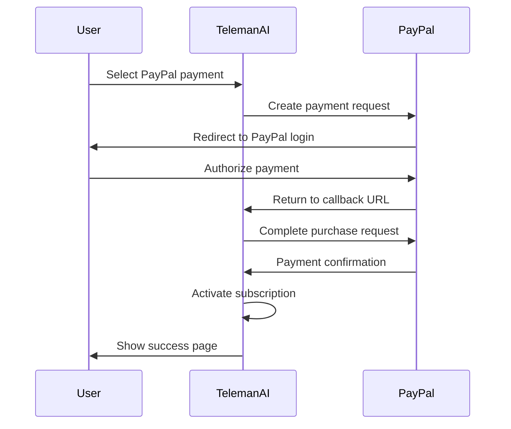

## Overview

PayPal is a globally recognized payment platform that allows TelemanAI users to accept payments via:

- PayPal accounts
- Credit and debit cards
- PayPal Credit
- Local payment methods in 200+ markets
- 25+ currencies

## Prerequisites

- A PayPal Business account ([Sign up here](https://www.paypal.com/bizsignup))
- Business verification completed
- Bank account linked to your PayPal account

## Setup Instructions

<Steps>
  <Step title="Create PayPal Business Account">
    1. Visit [PayPal Business Signup](https://www.paypal.com/bizsignup)
    2. Choose "Business Account" type
    3. Complete business information
    4. Verify your email address
    5. Link a bank account for withdrawals
  </Step>

  <Step title="Get API Credentials">
    1. Log in to [PayPal Developer Dashboard](https://developer.paypal.com/dashboard/)
    2. Go to **My Apps & Credentials**
    3. Choose **Sandbox** or **Live** depending on your needs

    **For Sandbox (Testing):**
    - Under "REST API apps", click **Create App**
    - Name your app (e.g., "TelemanAI Sandbox")
    - Copy the **Client ID** and **Secret**

    **For Live (Production):**
    - Switch to **Live** tab
    - Click **Create App**
    - Complete app details
    - Copy the **Client ID** and **Secret**

    <Warning>
      Keep your Client Secret secure. Never commit it to version control.
    </Warning>
  </Step>

  <Step title="Configure Environment Variables">
    Add PayPal credentials to your `.env` file:

    **For Sandbox Mode:**
    ```bash
    PAYPAL="YES"
    PAYPAL_SANDBOX=true
    PAYPAL_CLIENT_ID="AfmUVc-q4RP6nHk42Zm5nXqsgBLyFo9sJ_gqA5oiNDR7uKg86x0ZgZn38ottAvqhNnP5XpRg0vnSV5Zn"
    PAYPAL_CLIENT_SECRET="EJjA_ANpnIRwPNUEgQhjZVoIxLoSRqi8goN9g8P9PoTpjrOLtP6oythgk80KO0b_YkpCor29l5VXR6-4"
    PAYPAL_API_USERNAME="sb-oxtaj26870142@business.example.com"
    PAYPAL_API_PASSWORD="X)23m2"
    PAYPAL_CURRENCY="USD"
    ```

    **For Live Mode:**
    ```bash
    PAYPAL="YES"
    PAYPAL_SANDBOX=false
    PAYPAL_CLIENT_ID="your_live_client_id"
    PAYPAL_CLIENT_SECRET="your_live_client_secret"
    PAYPAL_API_USERNAME="your_live_username"
    PAYPAL_API_PASSWORD="your_live_password"
    PAYPAL_CURRENCY="USD"
    ```

    <Note>
      Always start with sandbox mode for testing before going live.
    </Note>
  </Step>

  <Step title="Configure in Dashboard">
    1. Log in to TelemanAI admin panel
    2. Navigate to **Settings** → **Payment Gateways** → **PayPal**
    3. Enter your PayPal credentials
    4. Select Sandbox or Live mode
    5. Set default currency
    6. Click **Save Configuration**
  </Step>
</Steps>

## Testing the Integration

<Steps>
  <Step title="Create Sandbox Accounts">
    1. In PayPal Developer Dashboard, go to **Sandbox** → **Accounts**
    2. You'll see pre-created test accounts:
       - **Business Account**: For receiving payments
       - **Personal Account**: For making test payments
    3. Click **View/Edit** to see account credentials
    4. Note the email and password for testing
  </Step>

  <Step title="Make a Test Purchase">
    1. Go to TelemanAI pricing page
    2. Select a subscription plan
    3. Click **Subscribe Now**
    4. Choose **PayPal** as payment method
    5. You'll be redirected to PayPal sandbox
    6. Log in with test personal account credentials
    7. Complete the payment
    8. You'll be redirected back to TelemanAI
  </Step>

  <Step title="Verify Payment">
    1. Check subscription is activated in TelemanAI
    2. Verify payment appears in sandbox business account
    3. Check invoice email was sent
    4. Review transaction in PayPal Developer Dashboard
  </Step>
</Steps>

## Payment Flow



## Implementation Details

### PayPal Gateway Service

See `PayPalGateway.php` for implementation:

```php
namespace App\Services\Payment;

use Omnipay\Omnipay;

class PayPalGateway implements PaymentGatewayInterface
{
    private $gateway;
    
    public function __construct()
    {
        $this->gateway = Omnipay::create('PayPal_Rest');
        $this->gateway->setClientId(env('PAYPAL_CLIENT_ID'));
        $this->gateway->setSecret(env('PAYPAL_CLIENT_SECRET'));
        $this->gateway->setTestMode(env('PAYPAL_SANDBOX', true));
    }
    
    public function pay(array $paymentData)
    {
        $response = $this->gateway->purchase([
            'amount'        => $paymentData['amount'],
            'currency'      => $paymentData['currency'] ?? 'USD',
            'returnUrl'     => route('payment.callback', ['gateway' => 'paypal']),
            'cancelUrl'     => route('payment.cancel'),
        ])->send();
        
        if ($response->isRedirect()) {
            return redirect()->away($response->getRedirectUrl());
        }
        
        throw new \Exception('PayPal Payment Failed: ' . $response->getMessage());
    }
}
```

See `PayPalGateway.php` (lines 8-45)

### Handling Payment Callback

```php
public function handleCallback()
{
    $response = $this->gateway->completePurchase([
        'payerId'              => request()->input('PayerID'),
        'transactionReference' => request()->input('paymentId'),
    ])->send();
    
    if ($response->isSuccessful()) {
        return [
            'success'       => true,
            'message'       => 'Payment successful.',
            'transactionId' => $response->getTransactionReference(),
            'amount'        => $response->getData()['transactions'][0]['amount']['total'],
        ];
    }
    
    return ['success' => false, 'message' => 'Payment verification failed.'];
}
```

See `PayPalGateway.php` (lines 52-73)

## Supported Currencies

PayPal supports 25+ currencies:

- USD - US Dollar
- EUR - Euro
- GBP - British Pound
- CAD - Canadian Dollar
- AUD - Australian Dollar
- JPY - Japanese Yen
- CNY - Chinese Yuan
- INR - Indian Rupee
- SGD - Singapore Dollar
- HKD - Hong Kong Dollar
- MXN - Mexican Peso
- BRL - Brazilian Real

[Full currency list](https://developer.paypal.com/docs/reports/reference/paypal-supported-currencies/)

<Note>
  Currency is set via `PAYPAL_CURRENCY` environment variable.
</Note>

## Webhook Configuration

Set up webhooks to receive payment notifications:

<Steps>
  <Step title="Create Webhook">
    1. In PayPal Developer Dashboard, go to your app
    2. Scroll to **Webhooks** section
    3. Click **Add Webhook**
    4. Enter webhook URL:
       ```
       https://your-domain.com/api/paypal/webhook
       ```
  </Step>

  <Step title="Select Event Types">
    Subscribe to these events:
    - `PAYMENT.CAPTURE.COMPLETED`
    - `PAYMENT.CAPTURE.DENIED`
    - `PAYMENT.CAPTURE.REFUNDED`
    - `CHECKOUT.ORDER.APPROVED`
    - `CHECKOUT.ORDER.COMPLETED`
  </Step>

  <Step title="Get Webhook ID">
    1. After creating webhook, copy the Webhook ID
    2. Add to `.env` file:
       ```bash
       PAYPAL_WEBHOOK_ID="your_webhook_id"
       ```
  </Step>
</Steps>

## Sandbox vs Live Mode

### Sandbox Mode (Testing)

```bash
PAYPAL_SANDBOX=true
PAYPAL_CLIENT_ID="sandbox_client_id"
PAYPAL_CLIENT_SECRET="sandbox_secret"
```

**Characteristics:**
- No real money processed
- Uses sandbox test accounts
- Separate API endpoints
- Testing environment only
- Full PayPal experience simulation

**Test Accounts:**
- Pre-created in Developer Dashboard
- Email format: `sb-xxxxx@personal.example.com`
- Password visible in dashboard
- Can create custom test accounts

### Live Mode (Production)

```bash
PAYPAL_SANDBOX=false
PAYPAL_CLIENT_ID="live_client_id"
PAYPAL_CLIENT_SECRET="live_secret"
```

**Requirements:**
- Verified PayPal Business account
- Bank account linked
- Business information complete
- HTTPS enabled (required)
- Terms accepted

<Warning>
  Never use sandbox credentials in production or vice versa.
</Warning>

## Routes Configuration

PayPal payment routes (see `routes/paypal.php`):

| Route | Method | Description |
|-------|--------|-------------|
| `/paypal/payment` | GET/POST | Initiate PayPal payment |
| `/paypal/callback` | GET | Payment return URL |
| `/paypal/cancel` | GET | Payment cancelled URL |
| `/paypal/webhook` | POST | Webhook endpoint |

## Database Schema

Payment records in `payment_histories` table:

```sql
INSERT INTO payment_histories (
    user_id,
    subscription_id,
    package_id,
    invoice,
    amount,
    payment_gateway,
    payment_status,
    transaction_id,
    created_at
) VALUES (
    1,
    123,
    5,
    'INV-2024-001',
    49.99,
    'PayPal',
    'paid',
    'PAYID-M5ABCDE-12345678',
    NOW()
);
```

## Security Best Practices

<Warning>
  **Security Recommendations:**
  
  1. **Protect API credentials:**
     - Use environment variables
     - Never commit to Git
     - Rotate keys if compromised
  
  2. **Enable HTTPS:**
     - Required for production
     - Secures payment redirect
     - Enables webhook verification
  
  3. **Verify webhooks:**
     - Validate webhook signatures
     - Check webhook ID matches
     - Verify payment amounts
  
  4. **Implement IPN validation:**
     - Verify IPN came from PayPal
     - Check transaction hasn't been processed
     - Validate receiver email
  
  5. **Handle payment status:**
     - Check for `COMPLETED` status
     - Handle `PENDING` appropriately
     - Log all transaction attempts
</Warning>

## Troubleshooting

<AccordionGroup>
  <Accordion title="Authentication Failed">
    **Problem:** `Authentication failed` error

    **Solution:**
    - Verify Client ID and Secret are correct
    - Ensure you're using correct mode (sandbox vs live)
    - Check credentials match the environment
    - Remove any extra spaces in `.env` file
    - Clear config cache: `php artisan config:clear`
  </Accordion>

  <Accordion title="Redirect Not Working">
    **Problem:** Not redirected to PayPal

    **Solution:**
    - Check `returnUrl` and `cancelUrl` are set correctly
    - Ensure URLs are publicly accessible
    - Verify HTTPS is enabled for production
    - Check PayPal API response for errors
    - Review application logs
  </Accordion>

  <Accordion title="Payment Approved But Not Processed">
    **Problem:** PayPal payment approved but subscription not activated

    **Solution:**
    - Verify callback route is accessible
    - Check `completePurchase` is called correctly
    - Ensure `PayerID` and `paymentId` are in URL
    - Review callback handler logic
    - Check database for payment record
  </Accordion>

  <Accordion title="Sandbox Account Login Fails">
    **Problem:** Can't log in with sandbox account

    **Solution:**
    - Verify you're on sandbox.paypal.com
    - Use the exact email from Developer Dashboard
    - Click "View/Edit" to see current password
    - Try resetting sandbox account password
    - Create a new sandbox test account
  </Accordion>

  <Accordion title="Currency Not Supported">
    **Problem:** Selected currency rejected

    **Solution:**
    - Check PayPal supports the currency
    - Verify currency code is correct (ISO 4217)
    - Ensure your account is enabled for that currency
    - Some currencies require account approval
    - Update `PAYPAL_CURRENCY` in `.env`
  </Accordion>

  <Accordion title="Webhook Not Received">
    **Problem:** Webhooks not hitting endpoint

    **Solution:**
    - Ensure webhook URL is publicly accessible
    - Verify HTTPS is enabled
    - Check webhook ID is correct
    - Test endpoint with PayPal's webhook simulator
    - Review webhook logs in PayPal Dashboard
  </Accordion>
</AccordionGroup>

## PayPal Dashboard

Key sections in PayPal Dashboard:

- **Activity**: View all transactions
- **Invoicing**: Create and send invoices
- **Reports**: Download transaction reports
- **Disputes**: Manage buyer disputes
- **API Credentials**: Manage API access
- **Webhook Events**: Monitor webhook delivery

## Advanced Features

### Express Checkout

Implement PayPal Express Checkout for faster payments:

```php
$response = $this->gateway->purchase([
    'amount' => $amount,
    'currency' => 'USD',
    'returnUrl' => route('paypal.success'),
    'cancelUrl' => route('paypal.cancel'),
    'brandName' => 'TelemanAI',
    'noShipping' => 1, // Digital goods
])->send();
```

### Subscription Billing

For recurring subscriptions:

```php
// Create billing plan
$plan = $paypal->createPlan([
    'name' => 'Monthly Subscription',
    'description' => 'TelemanAI Monthly Plan',
    'type' => 'INFINITE',
    'amount' => 49.99,
    'currency' => 'USD',
    'interval' => 'Month',
    'intervalCount' => 1,
]);

// Subscribe customer
$subscription = $paypal->createSubscription([
    'plan_id' => $plan->id,
    'return_url' => route('subscription.success'),
    'cancel_url' => route('subscription.cancel'),
]);
```

### Refunds

Process refunds programmatically:

```php
$refund = $this->gateway->refund([
    'transactionReference' => $transaction_id,
    'amount' => 49.99,
    'currency' => 'USD',
])->send();

if ($refund->isSuccessful()) {
    // Refund processed
}
```

## Going Live Checklist

<Steps>
  <Step title="Complete Business Verification">
    - Submit business documents to PayPal
    - Verify business email
    - Link bank account
    - Complete tax information
  </Step>

  <Step title="Update to Live Credentials">
    - Get live API credentials from Developer Dashboard
    - Update `.env` with live credentials
    - Set `PAYPAL_SANDBOX=false`
    - Clear config cache
  </Step>

  <Step title="Configure Live Webhooks">
    - Create webhook for production URL
    - Update `PAYPAL_WEBHOOK_ID`
    - Test webhook delivery
  </Step>

  <Step title="Enable HTTPS">
    - Install SSL certificate
    - Force HTTPS in application
    - Update return and cancel URLs
  </Step>

  <Step title="Test with Real Payment">
    - Make a small real transaction
    - Verify subscription activation
    - Check invoice generation
    - Test refund process
  </Step>
</Steps>

## Transaction Fees

PayPal charges transaction fees:

**Standard Rates (US):**
- Domestic: 2.9% + $0.30 per transaction
- International: 4.4% + fixed fee
- Currency conversion: 3-4% above exchange rate

**Micropayments (for transactions < $10):**
- 5% + $0.05 per transaction

<Note>
  Fees vary by country and transaction type. Check PayPal's pricing page for your region.
</Note>

## Next Steps

<CardGroup cols={2}>
  <Card title="Stripe Integration" icon="stripe" href="/integrations/stripe">
    Add Stripe as alternative payment method
  </Card>
  <Card title="Razorpay Integration" icon="credit-card" href="/integrations/razorpay">
    Configure Razorpay for Indian market
  </Card>
  <Card title="Subscription Management" icon="layer-group" href="/subscription/packages">
    Manage user subscriptions
  </Card>
  <Card title="Payment Analytics" icon="chart-line" href="/subscription/payment-gateways">
    Track payment metrics
  </Card>
</CardGroup>

## Additional Resources

- [PayPal Developer Documentation](https://developer.paypal.com/docs/)
- [PayPal REST API Reference](https://developer.paypal.com/api/rest/)
- [Sandbox Testing Guide](https://developer.paypal.com/api/rest/sandbox/)
- [PayPal Status Page](https://www.paypal-status.com/)
- [Omnipay PayPal Documentation](https://omnipay.thephpleague.com/gateways/paypal/)
