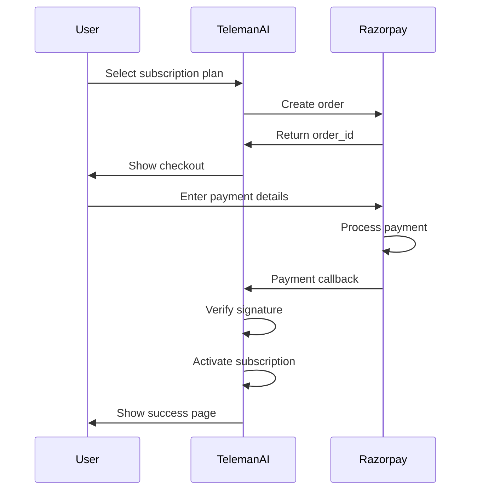

## Overview

Razorpay is India's leading payment gateway, offering:

- Credit and debit card payments
- Net banking
- UPI (Unified Payments Interface)
- Wallets (Paytm, PhonePe, etc.)
- EMI options
- International cards
- INR currency support

## Prerequisites

- A Razorpay account ([Sign up here](https://dashboard.razorpay.com/signup))
- KYC verification completed
- Business bank account linked
- GST number (for Indian businesses)

## Setup Instructions

<Steps>
  <Step title="Create Razorpay Account">
    1. Visit [Razorpay Signup](https://dashboard.razorpay.com/signup)
    2. Enter business details
    3. Verify email and mobile number
    4. Complete KYC verification
    5. Link your business bank account
  </Step>

  <Step title="Get API Keys">
    1. Log in to [Razorpay Dashboard](https://dashboard.razorpay.com/)
    2. Go to **Settings** → **API Keys**
    3. Click **Generate Test Keys** or **Generate Live Keys**

    **Test Mode Keys:**
    ```
    Key ID: rzp_test_xxxxxxxxxxxxx
    Key Secret: xxxxxxxxxxxxxxxxxxxxx
    ```

    **Live Mode Keys:**
    ```
    Key ID: rzp_live_xxxxxxxxxxxxx
    Key Secret: xxxxxxxxxxxxxxxxxxxxx
    ```

    <Warning>
      Keep your Key Secret secure. Never expose it in client-side code or commit to version control.
    </Warning>
  </Step>

  <Step title="Configure Environment Variables">
    Add Razorpay credentials to your `.env` file:

    **For Test Mode:**
    ```bash
    RAZORPAY="YES"
    RAZORPAY_KEY="rzp_test_vYLUhaqny75Hyj"
    RAZORPAY_SECRET="qGdRYD6MnnPqZw0e2qoPvI52"
    ```

    **For Live Mode:**
    ```bash
    RAZORPAY="YES"
    RAZORPAY_KEY="rzp_live_your_actual_key"
    RAZORPAY_SECRET="your_actual_secret"
    ```

    <Note>
      Always start with test keys during development.
    </Note>
  </Step>

  <Step title="Configure in Dashboard">
    1. Log in to TelemanAI admin panel
    2. Navigate to **Settings** → **Payment Gateways** → **Razorpay**
    3. Enter your Razorpay credentials:
       - Key ID (RAZORPAY_KEY)
       - Key Secret (RAZORPAY_SECRET)
    4. Click **Save Configuration**
  </Step>
</Steps>

## Testing the Integration

<Steps>
  <Step title="Use Test Cards">
    Razorpay provides test cards for different scenarios:

    **Successful Payment:**
    ```
    Card Number: 4111 1111 1111 1111
    CVV: Any 3 digits (e.g., 123)
    Expiry: Any future date (e.g., 12/25)
    Name: Any name
    ```

    **Payment Failed:**
    ```
    Card Number: 4000 0000 0000 0002
    ```

    **3D Secure Authentication:**
    ```
    Card Number: 5104 0600 0000 0008
    OTP: 1234 (any 4 digits work in test mode)
    ```

    [Full test card list](https://razorpay.com/docs/payments/payments/test-card-details/)
  </Step>

  <Step title="Test UPI Payment">
    For UPI testing:
    ```
    UPI ID: success@razorpay
    (Use any UPI ID in test mode)
    ```
  </Step>

  <Step title="Make a Test Purchase">
    1. Go to TelemanAI pricing page
    2. Select a subscription plan
    3. Click **Subscribe Now**
    4. Choose **Razorpay** payment method
    5. Select payment method (Card/UPI/Net Banking)
    6. Enter test card details
    7. Complete payment
    8. Verify subscription is activated
  </Step>
</Steps>

## Payment Flow



## Implementation Details

### Razorpay Gateway Service

See `RazorpayGateway.php` for implementation:

```php
namespace App\Services\Payment;

use Razorpay\Api\Api;

class RazorpayGateway implements PaymentGatewayInterface
{
    private function getApiInstance()
    {
        return new Api(env('RAZORPAY_KEY'), env('RAZORPAY_SECRET'));
    }
    
    public function pay(array $paymentData)
    {
        $api = $this->getApiInstance();
        
        // Create order
        $order = $api->order->create([
            'receipt'   => uniqid(),
            'amount'    => $paymentData['amount'] * 100, // Convert to paisa
            'currency'  => $paymentData['currency'] ?? 'INR',
            'payment_capture' => 1, // Auto-capture
        ]);
        
        return [
            'success'    => true,
            'order_id'   => $order['id'],
            'amount'     => $paymentData['amount'],
            'currency'   => $paymentData['currency'] ?? 'INR',
            'key_id'     => env('RAZORPAY_KEY'),
            'callback_url' => route('payment.callback', ['gateway' => 'razorpay']),
        ];
    }
}
```

See `RazorpayGateway.php` (lines 8-51)

### Payment Verification

```php
public function handleCallback()
{
    $api = $this->getApiInstance();
    
    // Get callback data
    $paymentId = request()->input('razorpay_payment_id');
    $orderId = request()->input('razorpay_order_id');
    $signature = request()->input('razorpay_signature');
    
    // Verify signature
    $generatedSignature = hash_hmac(
        'sha256',
        $orderId . "|" . $paymentId,
        env('RAZORPAY_SECRET')
    );
    
    if ($generatedSignature !== $signature) {
        return ['success' => false, 'message' => 'Signature verification failed.'];
    }
    
    // Fetch payment details
    $payment = $api->payment->fetch($paymentId);
    
    if ($payment['status'] === 'captured') {
        return [
            'success'       => true,
            'message'       => 'Payment successful.',
            'transactionId' => $paymentId,
            'amount'        => $payment['amount'] / 100,
        ];
    }
    
    return ['success' => false, 'message' => 'Payment verification failed.'];
}
```

See `RazorpayGateway.php` (lines 58-95)

### Razorpay Controller

Key routes (see `routes/razorpay.php`):

| Route | Method | Description |
|-------|--------|-------------|
| `/razorpay/payment` | POST | Create Razorpay order |
| `/razorpay/callback` | POST | Payment verification callback |
| `/razorpay/webhook` | POST | Webhook endpoint |

Controller implementation: `RazorpayController.php`

## Supported Payment Methods

Razorpay supports multiple payment methods:

### Cards
- Credit cards (Visa, Mastercard, Amex, RuPay)
- Debit cards
- International cards
- EMI options

### UPI
- Google Pay
- PhonePe
- Paytm
- BHIM
- All UPI apps

### Net Banking
- All major Indian banks
- 58+ bank options

### Wallets
- Paytm
- PhonePe
- Mobikwik
- Freecharge
- Ola Money

### Buy Now Pay Later
- LazyPay
- PayLater
- Simpl

<Note>
  Enable specific payment methods in Razorpay Dashboard under **Settings** → **Payment Methods**.
</Note>

## Webhook Configuration

Set up webhooks for real-time payment notifications:

<Steps>
  <Step title="Create Webhook">
    1. In Razorpay Dashboard, go to **Settings** → **Webhooks**
    2. Click **+ Add New Webhook**
    3. Enter webhook URL:
       ```
       https://your-domain.com/api/razorpay/webhook
       ```
    4. Enter a webhook secret (store this securely)
  </Step>

  <Step title="Select Events">
    Subscribe to these events:
    - `payment.captured`
    - `payment.failed`
    - `order.paid`
    - `refund.created`
    - `refund.processed`
  </Step>

  <Step title="Save Webhook Secret">
    Add the webhook secret to `.env`:
    ```bash
    RAZORPAY_WEBHOOK_SECRET="your_webhook_secret"
    ```
  </Step>
</Steps>

## Currency Support

Razorpay primarily supports INR (Indian Rupee):

```bash
# Default currency
RAZORPAY_CURRENCY="INR"
```

For international transactions:
- USD, EUR, GBP supported
- Requires international payments activation
- Contact Razorpay support to enable

## Amount Conversion

Razorpay uses **paisa** (1 INR = 100 paisa):

```php
// Convert rupees to paisa
$amountInPaisa = $amountInRupees * 100;

// Example: ₹49.99 = 4999 paisa
$order = $api->order->create([
    'amount' => 4999, // ₹49.99
    'currency' => 'INR',
]);

// Convert paisa back to rupees
$amountInRupees = $payment['amount'] / 100;
```

## Payment Modes

### Test Mode

```bash
RAZORPAY_KEY="rzp_test_..."
RAZORPAY_SECRET="test_secret"
```

**Characteristics:**
- No real money processed
- All payment methods available
- Test cards work
- Separate dashboard section
- No settlements

### Live Mode

```bash
RAZORPAY_KEY="rzp_live_..."
RAZORPAY_SECRET="live_secret"
```

**Requirements:**
- KYC completed
- Bank account verified
- Activation approved by Razorpay
- HTTPS enabled
- Proper error handling

<Warning>
  Test and live keys are completely separate. Never mix them.
</Warning>

## Security Features

### Signature Verification

Always verify Razorpay signatures:

```php
$signature = hash_hmac(
    'sha256',
    $orderId . '|' . $paymentId,
    env('RAZORPAY_SECRET')
);

if ($signature !== $razorpay_signature) {
    throw new Exception('Invalid signature');
}
```

### Webhook Signature Verification

```php
$webhookSecret = env('RAZORPAY_WEBHOOK_SECRET');
$webhookSignature = request()->header('X-Razorpay-Signature');
$webhookBody = request()->getContent();

$expectedSignature = hash_hmac('sha256', $webhookBody, $webhookSecret);

if ($webhookSignature !== $expectedSignature) {
    throw new Exception('Invalid webhook signature');
}
```

## Error Handling

Common Razorpay errors:

| Error Code | Description | Solution |
|------------|-------------|----------|
| `BAD_REQUEST_ERROR` | Invalid parameters | Check request data |
| `GATEWAY_ERROR` | Payment gateway issue | Retry or contact bank |
| `SERVER_ERROR` | Razorpay server error | Retry after some time |
| `AUTHENTICATION_ERROR` | Invalid API keys | Verify credentials |
| `INVALID_AMOUNT` | Amount validation failed | Check amount format |

## Troubleshooting

<AccordionGroup>
  <Accordion title="Authentication Error">
    **Problem:** `Authentication failed` error

    **Solution:**
    - Verify Key ID and Secret are correct
    - Ensure no extra spaces in `.env` file
    - Check you're using test keys in test mode
    - Confirm keys are active in Razorpay Dashboard
    - Clear config cache: `php artisan config:clear`
  </Accordion>

  <Accordion title="Signature Verification Failed">
    **Problem:** Signature mismatch error

    **Solution:**
    - Ensure you're using correct secret for signature
    - Verify order ID and payment ID are correct
    - Check the order of parameters in hash_hmac
    - Don't modify orderId or paymentId
    - Use exact format: `orderId|paymentId`
  </Accordion>

  <Accordion title="Payment Successful But Not Captured">
    **Problem:** Payment authorized but not captured

    **Solution:**
    - Set `payment_capture => 1` in order creation
    - Or manually capture the payment:
      ```php
      $payment = $api->payment->fetch($paymentId);
      $payment->capture(['amount' => $amount]);
      ```
    - Check auto-capture is enabled in dashboard
  </Accordion>

  <Accordion title="Webhook Not Received">
    **Problem:** Webhooks not hitting endpoint

    **Solution:**
    - Verify webhook URL is publicly accessible
    - Ensure HTTPS is enabled
    - Check webhook secret matches
    - Test with Razorpay webhook simulator
    - Review webhook logs in Razorpay Dashboard
    - Verify firewall allows Razorpay IPs
  </Accordion>

  <Accordion title="Test Card Declined">
    **Problem:** Test payment failing

    **Solution:**
    - Use correct test card: `4111 1111 1111 1111`
    - Ensure you're in test mode (using test keys)
    - Try different test cards
    - Check CVV is any 3 digits
    - Use any future expiry date
  </Accordion>

  <Accordion title="Amount Mismatch">
    **Problem:** Wrong amount charged

    **Solution:**
    - Remember to convert to paisa (multiply by 100)
    - Check currency is INR
    - Verify amount calculation logic
    - Don't mix rupees and paisa
  </Accordion>
</AccordionGroup>

## Razorpay Dashboard

Key sections:

- **Transactions**: View all payments
- **Orders**: Track order status
- **Customers**: Customer database
- **Settlements**: Payout information
- **Reports**: Download transaction reports
- **Disputes**: Handle customer disputes
- **API Keys**: Manage credentials
- **Webhooks**: Monitor webhook delivery

## Advanced Features

### Recurring Payments

Create subscription plans:

```php
// Create subscription plan
$plan = $api->plan->create([
    'period' => 'monthly',
    'interval' => 1,
    'item' => [
        'name' => 'Monthly Plan',
        'amount' => 99900, // ₹999
        'currency' => 'INR',
    ]
]);

// Create subscription
$subscription = $api->subscription->create([
    'plan_id' => $plan->id,
    'customer_notify' => 1,
    'total_count' => 12, // 12 months
]);
```

### Payment Links

Generate payment links:

```php
$link = $api->paymentLink->create([
    'amount' => 50000, // ₹500
    'currency' => 'INR',
    'description' => 'Subscription Payment',
    'customer' => [
        'name' => 'John Doe',
        'email' => 'john@example.com',
        'contact' => '+919876543210',
    ],
]);

echo $link->short_url; // Share this link
```

### Refunds

Process refunds:

```php
// Full refund
$refund = $api->payment->fetch($paymentId)->refund();

// Partial refund
$refund = $api->payment->fetch($paymentId)->refund([
    'amount' => 25000, // ₹250
]);
```

## Going Live Checklist

<Steps>
  <Step title="Complete KYC">
    - Submit business documents
    - Verify bank account
    - Submit GST details (if applicable)
    - Wait for Razorpay approval
  </Step>

  <Step title="Get Live Keys">
    - Generate live API keys
    - Update `.env` with live credentials
    - Store keys securely
  </Step>

  <Step title="Configure Webhooks">
    - Create webhook for production URL
    - Update webhook secret
    - Test webhook delivery
  </Step>

  <Step title="Enable Payment Methods">
    - Select payment methods in dashboard
    - Configure EMI options if needed
    - Set up international payments if required
  </Step>

  <Step title="Test Live Payment">
    - Make a small real payment
    - Verify settlement in bank account
    - Test refund process
    - Check invoice generation
  </Step>
</Steps>

## Transaction Fees

Razorpay pricing (India):

**Standard Pricing:**
- Domestic cards: 2% per transaction
- UPI: 2% per transaction
- Net Banking: 2% per transaction
- Wallets: 2% per transaction
- International cards: 3% + GST

**Startup Friendly:**
- First ₹25 lakh: 2%
- Beyond ₹25 lakh: Negotiable

<Note>
  Pricing may vary based on business volume. Contact Razorpay for custom pricing.
</Note>

## Next Steps

<CardGroup cols={2}>
  <Card title="Stripe Integration" icon="stripe" href="/integrations/stripe">
    Add Stripe for international payments
  </Card>
  <Card title="PayPal Integration" icon="paypal" href="/integrations/paypal">
    Configure PayPal payment gateway
  </Card>
  <Card title="Payment Overview" icon="credit-card" href="/integrations/payment-overview">
    View all payment gateways
  </Card>
  <Card title="Subscription Management" icon="layer-group" href="/subscription/packages">
    Manage subscriptions
  </Card>
</CardGroup>

## Additional Resources

- [Razorpay Documentation](https://razorpay.com/docs/)
- [API Reference](https://razorpay.com/docs/api/)
- [Test Cards](https://razorpay.com/docs/payments/payments/test-card-details/)
- [Razorpay Status](https://status.razorpay.com/)
- [Support](https://razorpay.com/support/)
