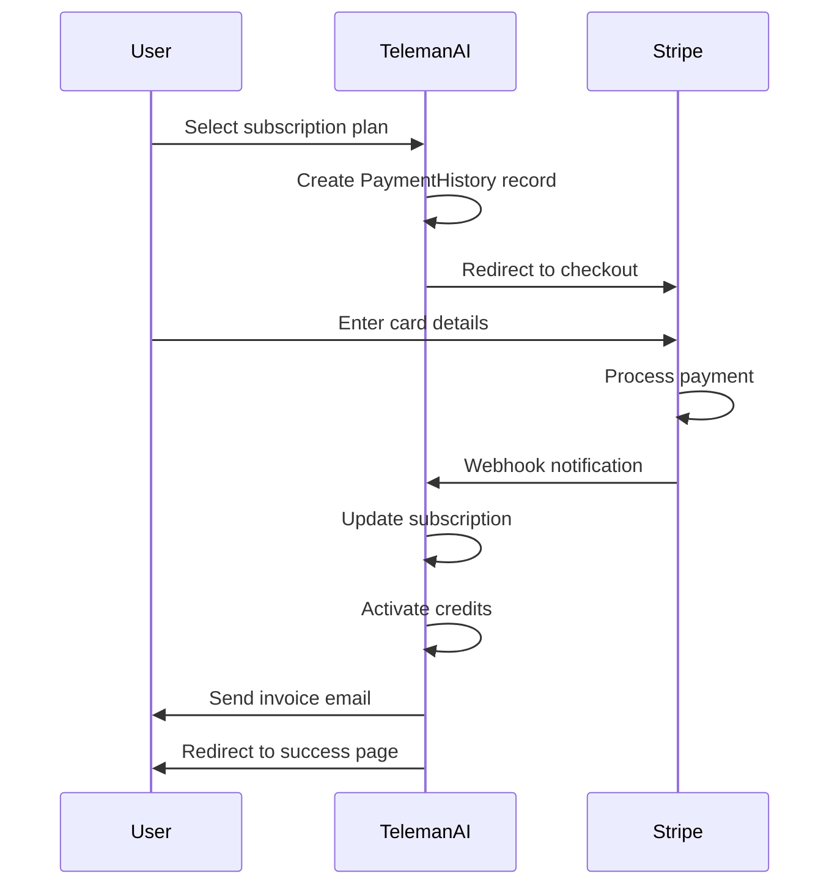

## Overview

Stripe is TelemanAI's recommended payment gateway for global subscription billing. It supports:

- Credit and debit card payments
- 135+ currencies
- Strong authentication (3D Secure)
- Automatic invoice generation
- Subscription management
- Webhook notifications

## Prerequisites

- A Stripe account ([Sign up here](https://dashboard.stripe.com/register))
- Business verification completed (for production)
- Bank account connected for payouts

## Setup Instructions

<Steps>
  <Step title="Create Stripe Account">
    1. Visit [Stripe Dashboard](https://dashboard.stripe.com/register)
    2. Sign up with your business email
    3. Complete business verification
    4. Add bank account for payouts
  </Step>

  <Step title="Get API Keys">
    1. Log in to [Stripe Dashboard](https://dashboard.stripe.com/)
    2. Click **Developers** → **API keys**
    3. You'll see two types of keys:

    **Test Mode Keys:**
    - Publishable key: `pk_test_...`
    - Secret key: `sk_test_...`

    **Live Mode Keys:**
    - Publishable key: `pk_live_...`
    - Secret key: `sk_live_...`

    <Warning>
      Never share your secret key publicly or commit it to version control.
    </Warning>
  </Step>

  <Step title="Configure Environment Variables">
    Add Stripe credentials to your `.env` file:

    **For Testing (Sandbox Mode):**
    ```bash
    STRIPE="YES"
    STRIPE_ENVIRONMENT="sandbox"
    STRIPE_KEY="pk_test_Nr6hlHbDo44RWI4N6QhdYZNP00KS5i1lKX"
    STRIPE_SECRET="sk_test_S5nEvoXdlANiZ82rWO99JEO800KB1boacQ"
    ```

    **For Production (Live Mode):**
    ```bash
    STRIPE="YES"
    STRIPE_ENVIRONMENT="production"
    STRIPE_KEY="pk_live_your_actual_key"
    STRIPE_SECRET="sk_live_your_actual_secret"
    ```

    <Note>
      Start with sandbox mode during development and testing.
    </Note>
  </Step>

  <Step title="Configure in Dashboard">
    1. Log in to TelemanAI admin panel
    2. Navigate to **Settings** → **Payment Gateways** → **Stripe**
    3. Enter your Stripe credentials:
       - Environment: `sandbox` or `production`
       - Publishable Key (STRIPE_KEY)
       - Secret Key (STRIPE_SECRET)
    4. Click **Save Configuration**

    <Note>
      This updates your `.env` file automatically.
    </Note>
  </Step>
</Steps>

## Testing the Integration

<Steps>
  <Step title="Use Test Cards">
    Stripe provides test card numbers for different scenarios:

    **Successful Payment:**
    ```
    Card Number: 4242 4242 4242 4242
    CVV: Any 3 digits (e.g., 123)
    Expiry: Any future date (e.g., 12/25)
    ZIP: Any 5 digits (e.g., 12345)
    ```

    **Payment Declined:**
    ```
    Card Number: 4000 0000 0000 0002
    ```

    **Insufficient Funds:**
    ```
    Card Number: 4000 0000 0000 9995
    ```

    [Full list of test cards](https://stripe.com/docs/testing)
  </Step>

  <Step title="Make a Test Purchase">
    1. Go to TelemanAI pricing page
    2. Select a subscription plan
    3. Click **Subscribe Now**
    4. Fill in billing information
    5. Enter test card number: `4242 4242 4242 4242`
    6. Complete the purchase
    7. Verify subscription is activated
  </Step>

  <Step title="Verify in Stripe Dashboard">
    1. Go to Stripe Dashboard → **Payments**
    2. You should see the test payment
    3. Check payment status and amount
    4. View customer details
  </Step>
</Steps>

## Webhook Configuration

Webhooks notify TelemanAI about payment events:

<Steps>
  <Step title="Create Webhook Endpoint">
    1. In Stripe Dashboard, go to **Developers** → **Webhooks**
    2. Click **Add endpoint**
    3. Enter your endpoint URL:
       ```
       https://your-domain.com/api/stripe/webhook
       ```
    4. Select events to listen for:
       - `payment_intent.succeeded`
       - `payment_intent.payment_failed`
       - `charge.refunded`
       - `customer.subscription.created`
       - `customer.subscription.updated`
       - `customer.subscription.deleted`
  </Step>

  <Step title="Get Webhook Secret">
    After creating the webhook:
    1. Click on the webhook endpoint
    2. Click **Reveal** under "Signing secret"
    3. Copy the secret (starts with `whsec_...`)
    4. Add to your `.env` file:
       ```bash
       STRIPE_WEBHOOK_SECRET="whsec_..."
       ```
  </Step>

  <Step title="Test Webhook">
    1. In Stripe Dashboard, go to webhook settings
    2. Click **Send test webhook**
    3. Select `payment_intent.succeeded`
    4. Click **Send test webhook**
    5. Verify TelemanAI receives the event
  </Step>
</Steps>

## Payment Flow

Understand how payments are processed:



## Implementation Details

### Stripe Controller

See `StripeController.php` for implementation:

**Key Methods:**

| Method | Description | Line Reference |
|--------|-------------|----------------|
| `index()` | Display Stripe setup page | 20-23 |
| `update()` | Save Stripe configuration | 26-46 |
| `stripe()` | Display payment form | 51-60 |
| `stripePost()` | Process payment | 63-164 |

### Payment Processing Logic

```php
// Create Stripe charge
Stripe\Stripe::setApiKey(env('STRIPE_SECRET'));

$charge = Stripe\Charge::create([
    'amount' => $payment->amount * 100, // Convert to cents
    'currency' => 'usd',
    'source' => $request->stripeToken,
    'description' => 'Subscription payment for ' . $user->name,
]);

if ($charge->paid == true) {
    // Update subscription
    $subscription->payment_status = 'paid';
    $subscription->payment_gateway = 'Stripe';
    $subscription->save();
    
    // Activate credits
    $credits->credit += $subscription->credit;
    $credits->save();
    
    // Send invoice
    Mail::to($user->email)->queue(new InvoiceMail($subscription));
}
```

See `StripeController.php` (lines 75-114)

### Stripe Gateway Service

```php
// Service implementation
namespace App\Services\Payment;

use Stripe\Stripe;
use Stripe\Charge;

class StripeGateway implements PaymentGatewayInterface
{
    public function pay(array $paymentData)
    {
        Stripe::setApiKey(env('STRIPE_SECRET'));
        
        $charge = Charge::create([
            'amount'      => $paymentData['amount'] * 100,
            'currency'    => $paymentData['currency'] ?? 'USD',
            'source'      => $paymentData['token'],
            'description' => $paymentData['description'] ?? 'Payment',
        ]);
        
        return [
            'message'        => 'Payment successful.',
            'transaction_id' => $charge->id,
            'amount'         => $paymentData['amount'],
        ];
    }
}
```

See `StripeGateway.php` (lines 11-31)

## Supported Currencies

Stripe supports 135+ currencies. Common ones:

- USD - US Dollar
- EUR - Euro
- GBP - British Pound
- CAD - Canadian Dollar
- AUD - Australian Dollar
- INR - Indian Rupee
- JPY - Japanese Yen
- SGD - Singapore Dollar

[Full currency list](https://stripe.com/docs/currencies)

<Note>
  To change the currency, update the `currency` parameter in the charge creation.
</Note>

## Invoice Generation

TelemanAI automatically generates PDF invoices:

```php
// Generate invoice PDF
$pdf = PDF::loadView('frontend.success.attachment_invoice', [
    'details' => $subscription_details,
])->save(invoice_path($subscription_details->invoice));

// Send invoice email
Mail::to($user->email)->queue(new InvoiceMail([
    'paymentHistory' => $subscription_details
]));
```

See `StripeController.php` (lines 128-138)

## Test vs Production Mode

### Sandbox Mode (Testing)

```bash
STRIPE_ENVIRONMENT="sandbox"
STRIPE_KEY="pk_test_..."
STRIPE_SECRET="sk_test_..."
```

**Characteristics:**
- Uses test API keys
- No real money charged
- Test cards accepted
- Separate dashboard data
- Webhooks can use localhost with Stripe CLI

### Production Mode (Live)

```bash
STRIPE_ENVIRONMENT="production"
STRIPE_KEY="pk_live_..."
STRIPE_SECRET="sk_live_..."
```

**Requirements:**
- Business verification complete
- Bank account connected
- HTTPS enabled (required)
- Public webhook endpoint
- Terms of service acceptance

<Warning>
  Never use live keys in sandbox mode or vice versa. Always keep test and production environments separate.
</Warning>

## Security Best Practices

<Warning>
  **Critical Security Measures:**
  
  1. **Never expose secret keys:**
     - Use environment variables
     - Don't commit to version control
     - Rotate keys if exposed
  
  2. **Use HTTPS in production:**
     - Required by Stripe
     - Protects customer data
     - Enables secure webhooks
  
  3. **Verify webhook signatures:**
     - Prevents webhook spoofing
     - Use `STRIPE_WEBHOOK_SECRET`
     - Validate all webhook events
  
  4. **Implement rate limiting:**
     - Prevent abuse
     - Limit payment attempts
     - Monitor for suspicious activity
  
  5. **Log all transactions:**
     - Audit trail
     - Debug payment issues
     - Compliance requirements
</Warning>

## Troubleshooting

<AccordionGroup>
  <Accordion title="Invalid API Key Error">
    **Problem:** `Invalid API Key provided: sk_test_...`

    **Solution:**
    - Verify the secret key is correct (no extra spaces)
    - Ensure you're using the right key for the environment
    - Check that `.env` file is properly loaded
    - Clear config cache: `php artisan config:clear`
  </Accordion>

  <Accordion title="Payment Succeeds but Subscription Not Activated">
    **Problem:** Charge successful in Stripe but user subscription inactive

    **Solution:**
    - Check webhook is configured and receiving events
    - Verify webhook secret is correct
    - Review TelemanAI logs for errors
    - Check database `payment_histories` and `subscriptions` tables
    - Manually trigger webhook from Stripe Dashboard
  </Accordion>

  <Accordion title="Test Card Declined">
    **Problem:** Test card `4242 4242 4242 4242` is declined

    **Solution:**
    - Ensure you're in test mode: `STRIPE_ENVIRONMENT="sandbox"`
    - Use test keys (starting with `pk_test_` and `sk_test_`)
    - Check you entered a future expiry date
    - Verify CVV is 3 digits
  </Accordion>

  <Accordion title="Currency Not Supported">
    **Problem:** "Currency not supported" error

    **Solution:**
    - Check Stripe supports your currency
    - Verify currency code is correct (ISO 4217)
    - Update the `currency` parameter in charge creation
    - Some currencies require specific account setup
  </Accordion>

  <Accordion title="Webhook URL Not Accessible">
    **Problem:** Stripe can't reach webhook endpoint

    **Solution:**
    - Ensure URL is publicly accessible (not localhost)
    - Verify SSL certificate is valid
    - Check server firewall allows Stripe IPs
    - Test URL accessibility with curl:
      ```bash
      curl -X POST https://your-domain.com/api/stripe/webhook
      ```
    - For local testing, use [Stripe CLI](https://stripe.com/docs/stripe-cli)
  </Accordion>
</AccordionGroup>

## Stripe Dashboard

Key sections of the Stripe Dashboard:

- **Payments**: View all transactions
- **Customers**: Manage customer records
- **Subscriptions**: Track recurring payments
- **Disputes**: Handle chargebacks
- **Logs**: Debug API requests
- **Webhooks**: Monitor webhook delivery
- **Reports**: Financial reporting

## Advanced Features

### 3D Secure Authentication

Stripe automatically handles Strong Customer Authentication (SCA):

```php
// 3D Secure is handled automatically
$charge = Charge::create([
    'amount' => $amount,
    'currency' => 'eur',
    'source' => $token,
    // Stripe handles 3DS if required
]);
```

### Payment Intents API

For advanced use cases, consider using Payment Intents:

```php
use Stripe\PaymentIntent;

$intent = PaymentIntent::create([
    'amount' => 1000,
    'currency' => 'usd',
    'payment_method_types' => ['card'],
]);
```

### Customer Portal

Allow customers to manage their subscriptions:

```php
$session = \Stripe\BillingPortal\Session::create([
    'customer' => $customer_id,
    'return_url' => route('dashboard'),
]);

return redirect($session->url);
```

## Going Live Checklist

<Steps>
  <Step title="Complete Business Verification">
    - Submit business documents
    - Verify bank account
    - Accept Stripe terms
  </Step>

  <Step title="Update to Live Keys">
    - Replace test keys with live keys
    - Set `STRIPE_ENVIRONMENT="production"`
    - Clear config cache
  </Step>

  <Step title="Configure Live Webhooks">
    - Create webhook for production URL
    - Update `STRIPE_WEBHOOK_SECRET`
    - Test webhook delivery
  </Step>

  <Step title="Enable HTTPS">
    - Install SSL certificate
    - Force HTTPS in application
    - Update all URLs to HTTPS
  </Step>

  <Step title="Test End-to-End">
    - Make a real small payment
    - Verify subscription activation
    - Check invoice generation
    - Test webhook notifications
  </Step>
</Steps>

## Next Steps

<CardGroup cols={2}>
  <Card title="PayPal Integration" icon="paypal" href="/integrations/paypal">
    Add PayPal as an alternative payment method
  </Card>
  <Card title="Subscription Plans" icon="layer-group" href="/subscription/packages">
    Configure your subscription plans
  </Card>
  <Card title="Invoice Customization" icon="file-invoice" href="/subscription/payment-gateways">
    Customize invoice templates
  </Card>
  <Card title="Payment Analytics" icon="chart-line" href="/subscription/payment-gateways">
    Track payment metrics
  </Card>
</CardGroup>

## Additional Resources

- [Stripe Documentation](https://stripe.com/docs)
- [Stripe API Reference](https://stripe.com/docs/api)
- [Stripe Testing Guide](https://stripe.com/docs/testing)
- [Stripe Status Page](https://status.stripe.com/)
